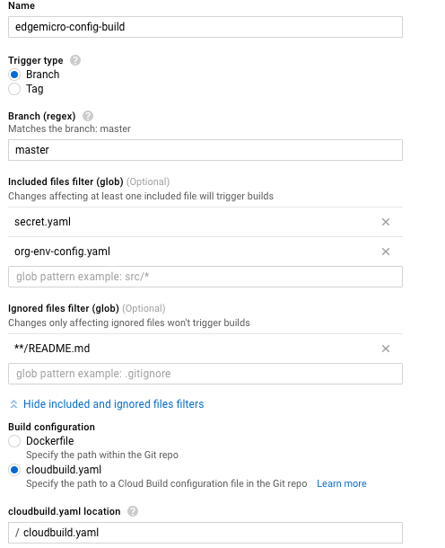

# apigee-edgemicro-k8s-demo

This project was originally published under GCP Cloud Source Repositories under the project named `apigee-k8s-edgemicro-sw`.  The Google Cloud Source repository name is `edgemicro-config`.  

The GCP Source Repository for the custom plugin is named `edgemicro-k8s-custom-plugin`, which is also under the `apigee-k8s-edgemicro-sw` repository.

This repo demonstrates how to build a CI/CD process with Edgemicro and Kubernetes.

## Prerequisites
1. Signup for [Google Cloud Platform](https://cloud.google.com/)
2. Enable [Google Cloud Build](https://cloud.google.com/cloud-build/) for your project
3. Enable [Google Cloud Source Repository](https://cloud.google.com/source-repositories/) for your project
4. [Create a Kubernetes cluster](https://github.com/apigee-internal/microgateway/tree/master/kubernetes)
5. Complete part 1 and part 2 of [Configure and setup the Microgateway](https://docs.apigee.com/api-platform/microgateway/2.5.x/setting-and-configuring-edge-microgateway)
6. Copy your Edge Microgateway config file (`org-env-config.yaml`) file to this directory.  

## Create a new Google Cloud Build configuration
The configuration for Google Cloud Build is shown below. Make sure to update the `included files filter` to your Apigee Edge Microgateway configuration file. **Be sure to change `org-env-config.yaml` to your Apigee Edge organization and environment.**



## Secret.yaml
If you followed the instructions in "[creating a Kubernetes cluster](https://github.com/apigee-internal/microgateway/tree/master/kubernetes)", then you already created the `mgwsecret` in your K8S cluster. The Microgateway will use this secret object to pull the Apigee organization name, environment, microgateway key & secret, and the Edge Microgateway configuration file when the pod starts the container.  These values will be available to the Microgateway via environment variables.  The GCP Build uses this `secret.yaml` file to update the existing secret object in the Kubernetes cluster.  

## cloudbuild.yaml
The `cloudbuild.yaml` file contains three steps.  
1. Execute `update-secret-yaml.sh`, which updates the secret.yaml file with the changes in the Edgemicro config file and creates a new secret.yaml file.
2. Apply the updated secret.yaml file (push the changes to the k8s cluster). **This does not update the existing Microgateway pods.**
3. Delete the existing microgateway pods, because they will not pick up the changes from the updated secrets object. The deployment will automatically create new pods which will have the updated configuration.  

## Update the microgateway.sh file
Add the following to the `microgateway.sh` file.
* Apigee org
* Apigee env
* Microgateway key
* Microgateway secret

**You get the Microgateway Key and Secret after you run the edgemicro configure command.**

## Demo
1. Clone the repository.
```
gcloud source repos clone edgemicro-config --project=YOUR_GCP_PROJECT_NAME
```

2. Update your Edgemicro YAML file (e.g. add a new policy, update config) and then base64 encode it.  

For example, add the `spikearrest` plugin to your `org-env-config.yaml` file and also add the `spikearrest` stanza.

```
plugins:
  sequence:
    - oauth
    - spikearrest
...

spikearrest:
   timeUnit: minute
   allow: 5
   bufferSize: 0
```


3. Save your `org-env-config.yaml` file.

4. Push your changes.  The `cloudbuild.yaml` file will update the `secret.yaml` file during the build process.

```
git push -u origin master
```

5. Once you push your changes you should see the new build appear and run in the build history.  You can click on the build and view the logs of each build step.


You can also navigate to **Kubernetes Engine** > **Workloads** and click on the `edge-microgateway` workload to see the new pod start and the old pod should be in the `terminating` state.


Alternatively, you can also run the following command and you should see one new pod and one pod being terminated.  
```
kubctl get pods
```

6. Run the following shell script command to test that the new pod is using the updated Edgemicro config file.

```
for i in {1..20}; do curl http://$GATEWAY_IP/edgemicro_k8s_hello/ -H "x-api-key:YOUR_APIKEY"; done
```

You should see something similar to the what is shown below.
```
Hello world
Hello world
{"message":"SpikeArrest engaged","status":503}
{"message":"SpikeArrest engaged","status":503}
{"message":"SpikeArrest engaged","status":503}
{"message":"SpikeArrest engaged","status":503}
{"message":"SpikeArrest engaged","status":503}
{"message":"SpikeArrest engaged","status":503}
{"message":"SpikeArrest engaged","status":503}
{"message":"SpikeArrest engaged","status":503}
{"message":"SpikeArrest engaged","status":503}
{"message":"SpikeArrest engaged","status":503}
{"message":"SpikeArrest engaged","status":503}
{"message":"SpikeArrest engaged","status":503}
{"message":"SpikeArrest engaged","status":503}
{"message":"SpikeArrest engaged","status":503}
{"message":"SpikeArrest engaged","status":503}
{"message":"SpikeArrest engaged","status":503}
{"message":"SpikeArrest engaged","status":503}
{"message":"SpikeArrest engaged","status":503}%
```
