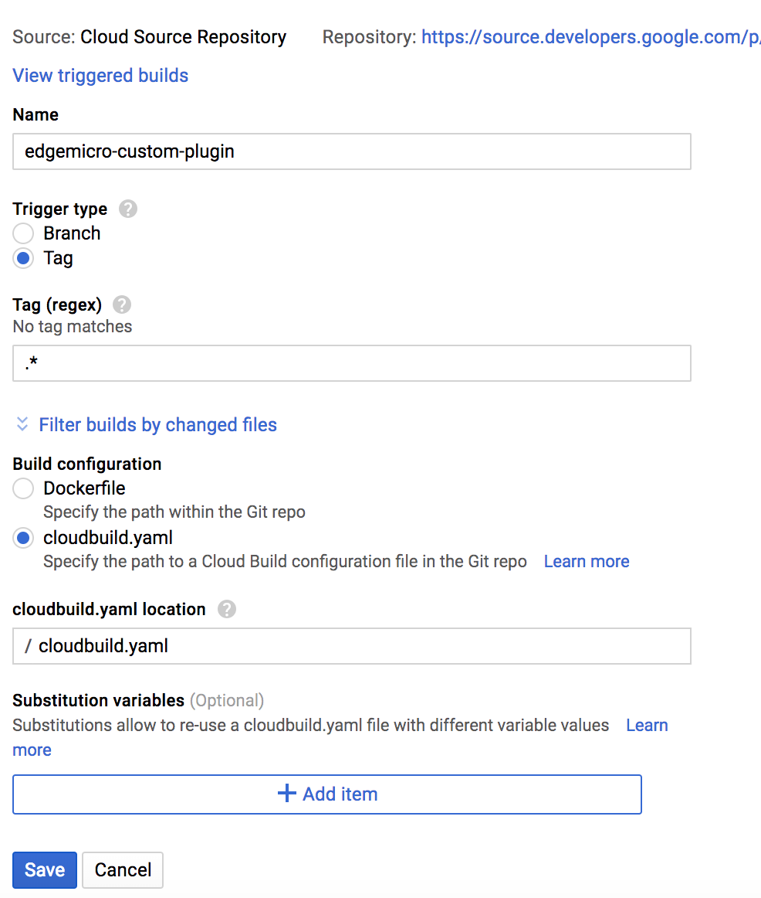
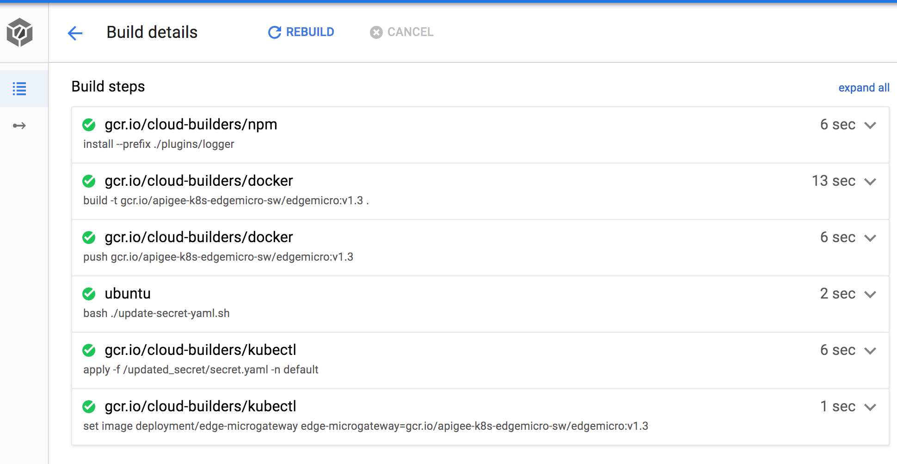
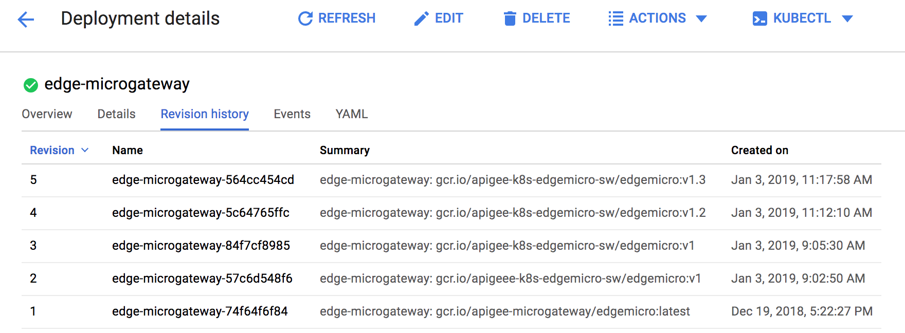

# edgemicro-k8s-custom-plugin

This project was originally published under GCP Cloud Source Repositories under the project named `apigee-k8s-edgemicro-sw`.  The Google Cloud Source repository name is `edgemicro-config`.  

The GCP Source Repository for the custom plugin is named `edgemicro-k8s-custom-plugin`, which is also under the `apigee-k8s-edgemicro-sw` GCP project.

This repo demonstrates how to build a CI/CD process for a custom Edge Microgateway plugin and it deploys that plugin to an Edge Microgateway running on Kubernetes.  The custom plugins are included within the Docker image, and the GCP build updates the deployment's container image based on the repository's tag and then pulls the updated image when a new pod is created.  The build is triggered when you add a tag to the Github repository.

The advantage of using this approach is that there is zero Micorgateway downtime when you update the custom plugin because K8S performs a [rolling update](https://kubernetes.io/docs/tasks/run-application/rolling-update-replication-controller/).  

## Summary
* The logger plugin is based on the following [documentation](https://apigee.com/about/blog/api-technology/tutorial-adding-logger-plugin-apigee-edge-microgateway).  
* The `plugins/logger` directory contains the Microgateway custom plugin code.  
* This documentation follows the approach outlined in the [Microgateway Github repository](https://github.com/apigee-internal/microgateway/tree/master/kubernetes/docker/edgemicro#option-2-build-plugins-into-the-container).


## Prerequisites
1. Follow the prerequisites listed [here](https://github.com/swilliams11/apigee-edgemicro-k8s-demo#prerequisites).
2. You should be familiar with [how to create a custom plugin](https://docs.apigee.com/api-platform/microgateway/2.5.x/develop-custom-plugins) in Edge Microgateway
3. This demo uses [Google Cloud Container Registry](https://cloud.google.com/container-registry)
4. Copy your Edge Microgateway config file to this directory and ensure that it includes the following plugins. (see the example `org-test-config.yaml`)
```
  plugins:
    sequence:
      - oauth
      - logger
      - accumulate-response
  ```
5. Update the `microgateway.sh` file with your Apigee Edge org and environment names and include the Microgateway's key and secret that you received when you configured the Microgateway.  


## Google Cloud Build
You should configure the build as shown below.  Notice that it will build only if you push a tag to the repository.  




## Secret.yaml
If you followed the instructions in "[creating a Kubernetes cluster](https://github.com/apigee-internal/microgateway/tree/master/kubernetes)", then you already created the `mgwsecret` in your K8S cluster. The Microgateway will use this secret object to pull the Apigee organization name, environment, microgateway key & secret, and the Edge Microgateway configuration file when the pod starts the container.  These values will be available to the Microgateway via environment variables.  The GCP Build uses this `secret.yaml` file to update the existing secret object in the Kubernetes cluster.  


## cloudbuild.yaml
The `cloudbuild.yaml` file contains six steps.  
1. Execute `npm install` to install the plugins dependencies.
2. Build a docker image with the custom plugin code included in the image and updates the image tag
3. Push the docker image to Google Cloud Containers within your GCP project.
4. Update the `secret.yaml` file with the updated Micorgateway config file.
   * This double base64 encodes the Microgateway config file and includes it in the `secret.yaml` file.
5. Execute `kubectl apply` with the updated `secret.yaml` file `-f` argument; this pushes the changes to the k8s cluster. **This does not update the existing Microgateway pods.**
6. Update the deployments container image to include the image pushed in step 3.  **This updates the containers to use the new container image and starts the rolling update.**


## Update the microgateway.sh file
Add the following to the `microgateway.sh` file.
* Apigee org
* Apigee env
* Microgateway key
* Microgateway secret

**You get the Microgateway key and secret after you run the [edgemicro configure command](https://docs.apigee.com/api-platform/microgateway/2.5.x/setting-and-configuring-edge-microgateway#Part1).**


## Demo
By default you only have one pod running.

1. Execute the following commands to trigger a build.
```
git tag -a v1 -m "version 1"
git push origin v1
```

or

```
./tag-add.sh v1
```

2. You should see all six build steps succeed.


Once all steps in the build succeed you can view the pod revision history.



3. Run the following shell script command to test that the new pod is using the updated Edge Microgateway config file.

```
for i in {1..20}; do curl http://$GATEWAY_IP/edgemicro_k8s_hello/ -H "x-api-key:YOUR_APIKEY"; done
```

You should see something similar to the what is shown below.
```
Hello world
Hello world
...
```

4. Ssh into a running container.
```
kubectl get pods
```
Response:
```
NAME                                 READY     STATUS    RESTARTS   AGE
edge-microgateway-84f7cf8985-7nb4v   1/1       Running   0          50m
helloworld-69c457bf98-hzv74          1/1       Running   0          14d
```

```
kubectl exec -it edge-microgateway-84f7cf8985-7nb4v -- /bin/sh
```

5. You can view the Bunyan log file within the container by executing the following command.
```
vi /var/tmp/edgemicrogateway-bunyan-info.log
```

6. You can also view the edgemicro config file.
```
ls /opt/apigee/.edgemicro
vi /opt/apigee/.edgemicro/YOURORG-ENV-config.yaml
```


7. Modify the logger plugin (anyway you like) and commit your code and push a new tag as shown below.
You should see the the new build triggered in the Google Cloud Build history.  
```
git tag -a v1.2 -m "version 1.2"
git push origin v1.2
```
or
```
./tag-add.sh v1.2
```

### Rolling Updates
K8S Deployments allow you to perform [rolling updates](https://kubernetes.io/docs/tasks/run-application/rolling-update-replication-controller/).  


1. If you want to see K8S perform a rolling update, then increase the replica count to 3 (assuming you have enough bandwith in your K8S cluster).  
```
kubectl scale deployment edge-microgateway --replicas=3
```

Check that the deployment was scaled successfully.
```
kubectl get deployment
```

2. Configure autoscaling on the deployment. Review the "rolling update" documentation above to understand what this command is doing.
```
kubectl autoscale deployment edge-microgateway --min=3 --max=5 --cpu-percent=80
```

3. Now make a change to the logger plugin, commit and push your code to the remote repo, then add and push a new tag to the remote repo.

```
./tag-add.sh v1.3
```

or

```
git tag -a v1.3 -m "version 1.3"
git push origin v1.3
```

4. You can monitor the result of the rollout with the following commands.
```
kubectl get deployment edge-microgateway
```
```
NAME                DESIRED   CURRENT   UP-TO-DATE   AVAILABLE   AGE
edge-microgateway   3         4         3            2           14d
```

* View the rollout history.
  ```
  kubectl rollout history deployment edge-microgateway
  ```
  ```
  deployments "edge-microgateway"
  REVISION  CHANGE-CAUSE
  1         <none>
  2         <none>
  3         <none>
  4         <none>
  5         <none>
  6         <none>
  ```

* Get the rollout status.
  ```
  kubectl rollout status deployment edge-microgateway
  ```
  ```
  Waiting for rollout to finish: 2 out of 3 new replicas have been updated...
  ```

#### Cancel a rollout
```
kubectl rollout undo deployment edge-microgateway
```

If you view the rollout status you should see something similar to the console below.
```
kubectl rollout status deployment edge-microgateway
```
```
Waiting for rollout to finish: 1 old replicas are pending termination...
Waiting for rollout to finish: 1 old replicas are pending termination...
Waiting for rollout to finish: 2 of 3 updated replicas are available...
Waiting for rollout to finish: 2 of 3 updated replicas are available...
```

## Delete the tag from remote and local repositories
You can delete a tag from the remote repository with the following commands.
```
git push --delete origin v1
git tag --delete v1
```

or

```
./tag-delete.sh v1
```

## tag-delete.sh and tag-add.sh
`tag-delete.sh` and `tag-add.sh` are short cut scripts that executes both the `git tag` and `git push`.


## Notes
My GCP project contains two repositories named `edgemicro-config` and `edgemicro-k8s-custom-plugin`, which I have combined into a single Github repository; therefore some files are duplicated and this repository needs some reorganization.

* `handle-plugins.sh` is not used in this `cloudbuild.yaml` file.  This shell script was developed to zip the plugins into a single directory, but the zip command is not available in `gsutil` from Cloud Build.
* `edgemicro-deployment.yaml` also is not used in the `cloudbuild.yaml` file.  This file represents the deployment and could be used to create a rolling upgrade in the last step of `cloudbuild.yaml`.
